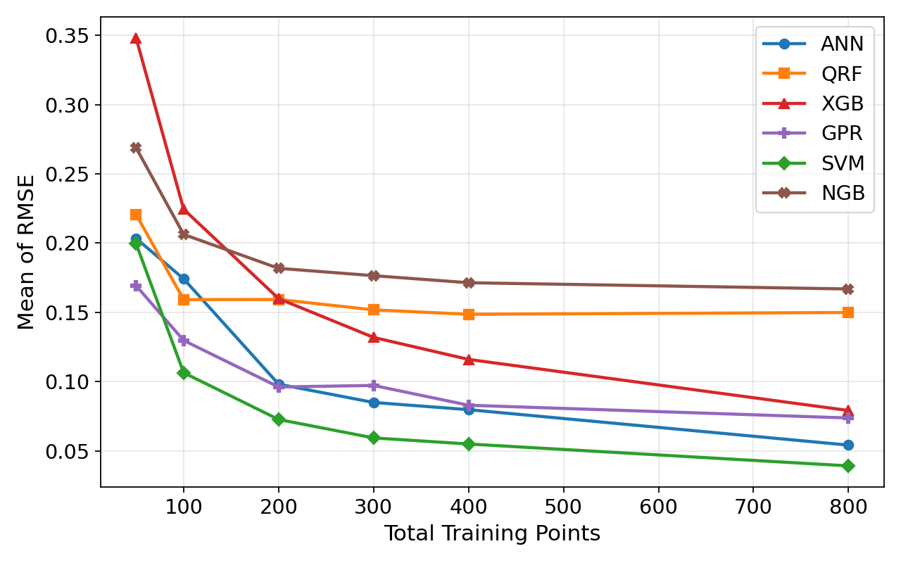
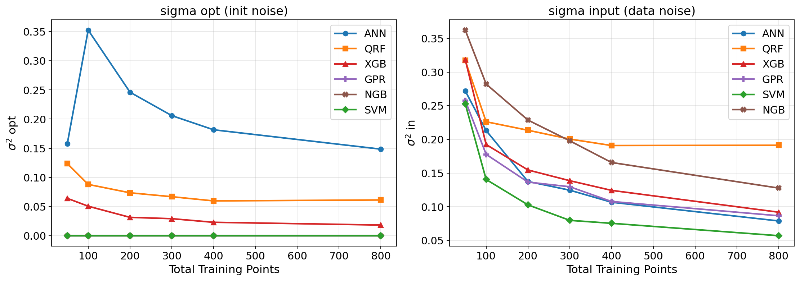
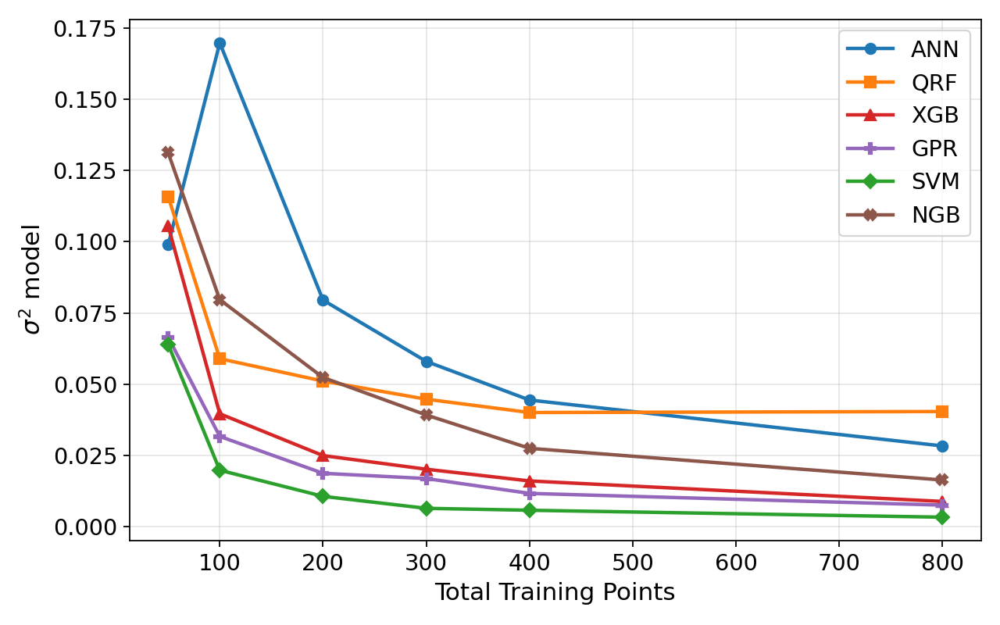

# Sec 5.1 — SVMs are Less Uncertain for PI Estimation (Uncertainty Decomposition: σ_opt / σ_in)

Sweeps training-set size N and measures σ²_opt (optimisation variance across initialisations) and σ²_in (input variance across data draws) for NN, QRF, SVM, GPR, XGB.

## Files

- `uncertainty_decomp_size_sweep.py` — main sweep script (D×I = 10×10 protocol)
- `replot.py` — regenerate figures from saved CSV without re-running
- `exp9_tables_and_figures.tex` — LaTeX source for the section tables/figures

## Run

```bash
python uncertainty_decomp_size_sweep.py
```

Results saved to `outputs/`. Re-plot only:

```bash
python replot.py
```

## Figures (from paper)

**Figure — Sum of RMSEs vs. training size N.** SVM achieves the lowest sum_rmse from N ≥ 100 onward.



**Figure — σ_opt (left) and σ_in (right) vs. training size N.** SVM and GPR have σ_opt = 0 at every size; SVM additionally achieves the lowest σ_in from N ≥ 100.



**Figure — σ_model = √(σ²_opt + σ²_in) vs. training size N.**



## Full Results Table

Uncertainty decomposition across training sizes N for all models. σ_model = √(σ²_opt + σ²_in). SVM and GPR are deterministic (σ_opt = 0).

| Model | N | Sum RMSE | σ_opt | σ_in | σ_model | PICP | MPIW |
|---|---|---|---|---|---|---|---|
| ANN | 50 | 0.2034 | 0.1578 | 0.2720 | 0.3145 | 0.8235 | 1.6274 |
| ANN | 100 | 0.1742 | 0.3527 | 0.2131 | 0.4121 | 0.9178 | 1.9174 |
| ANN | 200 | 0.0981 | 0.2462 | 0.1375 | 0.2820 | 0.9223 | 1.8470 |
| ANN | 300 | 0.0849 | 0.2060 | 0.1246 | 0.2408 | 0.9242 | 1.8453 |
| ANN | 400 | 0.0797 | 0.1817 | 0.1067 | 0.2107 | 0.9260 | 1.8411 |
| ANN | 800 | 0.0541 | 0.1485 | 0.0789 | 0.1682 | 0.9175 | 1.8118 |
| QRF | 50 | 0.2206 | 0.1237 | 0.3171 | 0.3404 | 0.8587 | 1.7645 |
| QRF | 100 | 0.1592 | 0.0880 | 0.2262 | 0.2427 | 0.8537 | 1.7063 |
| QRF | 200 | 0.1593 | 0.0736 | 0.2136 | 0.2260 | 0.8430 | 1.6715 |
| QRF | 300 | 0.1518 | 0.0669 | 0.2005 | 0.2114 | 0.8442 | 1.6633 |
| QRF | 400 | 0.1486 | 0.0597 | 0.1909 | 0.2000 | 0.8543 | 1.6800 |
| QRF | 800 | 0.1499 | 0.0613 | 0.1913 | 0.2009 | 0.8478 | 1.6625 |
| **SVM** | 50 | 0.1995 | **0.0** | 0.2529 | 0.2529 | 0.8000 | 1.5653 |
| **SVM** | 100 | 0.1064 | **0.0** | 0.1405 | 0.1405 | 0.8753 | 1.7155 |
| **SVM** | 200 | 0.0726 | **0.0** | 0.1028 | 0.1028 | 0.8928 | 1.7555 |
| **SVM** | 300 | 0.0593 | **0.0** | 0.0798 | 0.0798 | 0.8987 | 1.7688 |
| **SVM** | 400 | 0.0549 | **0.0** | 0.0754 | 0.0754 | 0.9033 | 1.7792 |
| **SVM** | 800 | 0.0391 | **0.0** | 0.0570 | 0.0570 | 0.9088 | 1.7858 |
| XGB | 50 | 0.3480 | 0.0641 | 0.3185 | 0.3249 | 0.7022 | 1.4064 |
| XGB | 100 | 0.2245 | 0.0506 | 0.1924 | 0.1989 | 0.7858 | 1.5536 |
| XGB | 200 | 0.1599 | 0.0315 | 0.1546 | 0.1578 | 0.8195 | 1.6135 |
| XGB | 300 | 0.1319 | 0.0292 | 0.1387 | 0.1418 | 0.8368 | 1.6460 |
| XGB | 400 | 0.1160 | 0.0230 | 0.1243 | 0.1264 | 0.8545 | 1.6785 |
| XGB | 800 | 0.0791 | 0.0183 | 0.0919 | 0.0937 | 0.8728 | 1.7182 |
| GPR | 50 | 0.1692 | **0.0** | 0.2578 | 0.2578 | 0.8692 | 1.7354 |
| GPR | 100 | 0.1297 | **0.0** | 0.1778 | 0.1778 | 0.8582 | 1.6962 |
| GPR | 200 | 0.0961 | **0.0** | 0.1366 | 0.1366 | 0.8730 | 1.7145 |
| GPR | 300 | 0.0972 | **0.0** | 0.1297 | 0.1297 | 0.8663 | 1.7018 |
| GPR | 400 | 0.0829 | **0.0** | 0.1078 | 0.1078 | 0.8685 | 1.7023 |
| GPR | 800 | 0.0737 | **0.0** | 0.0866 | 0.0866 | 0.8668 | 1.7032 |


