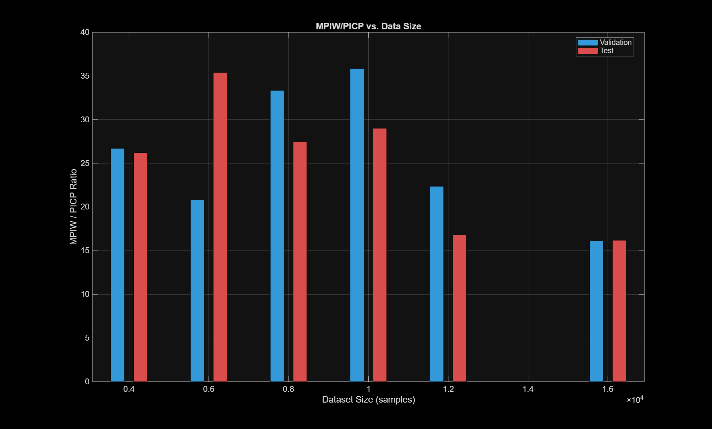
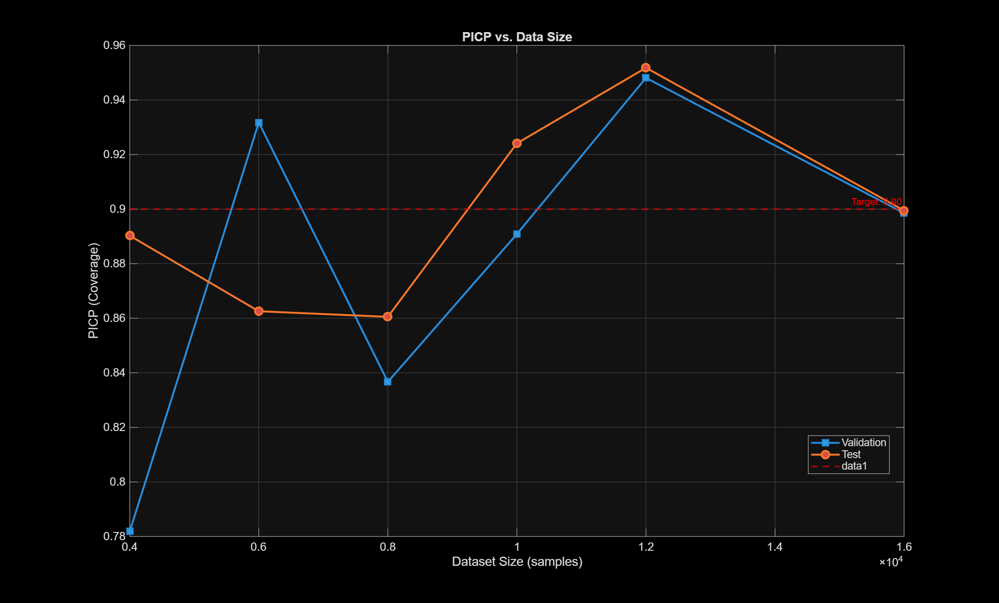
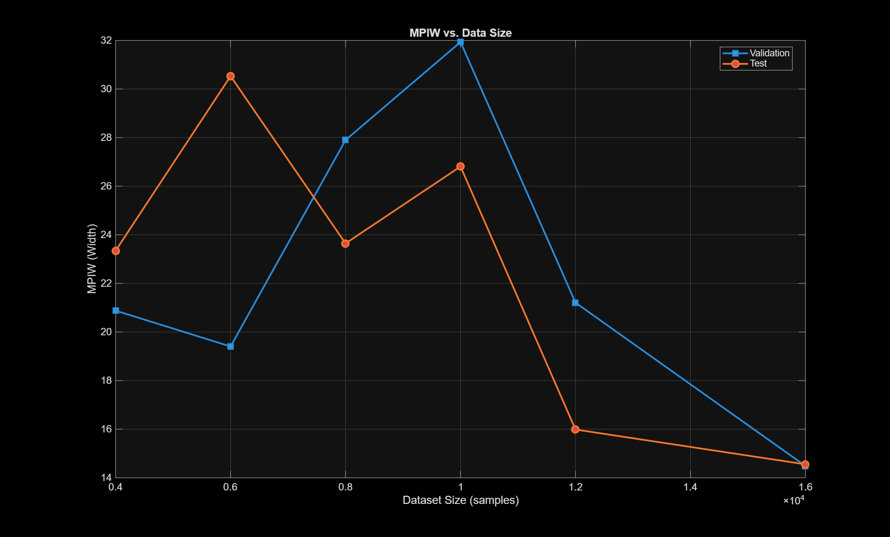
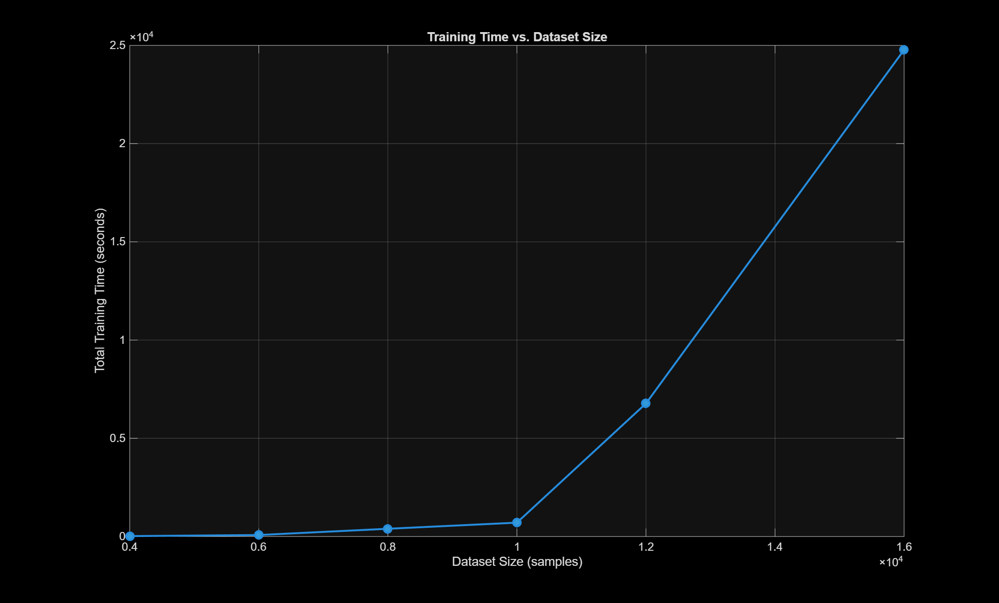
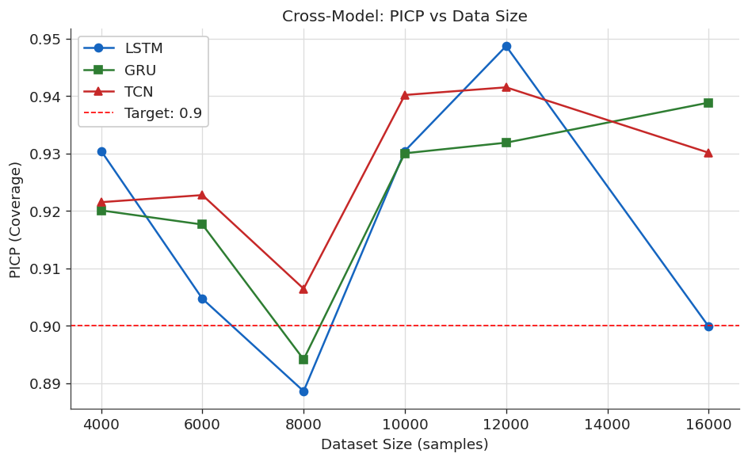
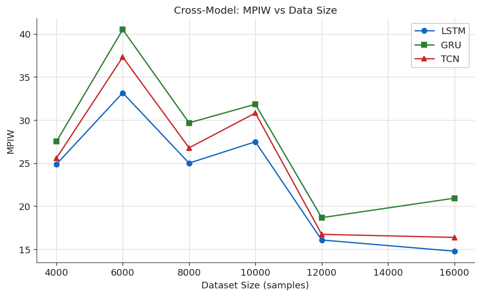
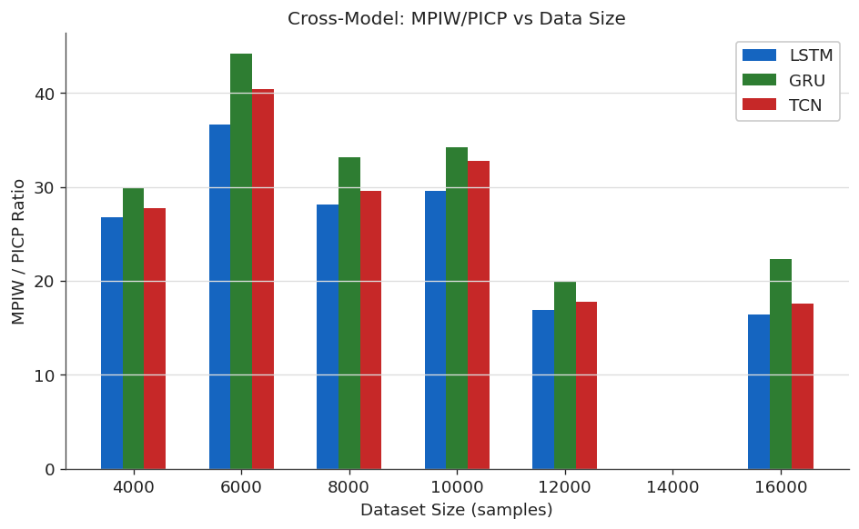

# Sec 5.4.1 — Scalability: SVM vs. Deep-Learning Models on Amprion Load Data

Evaluates SVQR and NN quantile regression at increasing training-set sizes on the Amprion electricity load dataset (~15 000 samples, 24-step sliding window).

## Files

- `svqr_matlab/energy_amprion_svqr_new.m` — SVQR sweep over dataset sizes (MATLAB)
- `nn_python/v3_amprion.py` — NN benchmark at multiple sizes (Python)

## Run

SVQR (MATLAB):
```matlab
cd svqr_matlab
energy_amprion_svqr_new
```

NN (Python):
```bash
python nn_python/v3_amprion.py
```

## Dataset

`shared/datasets/Amprion.csv` — hourly electricity load (Amprion TSO, Germany).

Outputs written to `svqr_matlab/outputs/` and `nn_python/outputs/`.

## Figures (from paper)

### SVQR (MATLAB) — scaling to 16k samples

**MPIW / PICP ratio vs. data size.**



**PICP vs. data size** — target coverage 0.90.



**MPIW vs. data size.**



**Training time vs. data size.**



### Deep-learning baselines (LSTM / GRU / TCN)

**Cross-model PICP vs. data size** — all NN baselines side-by-side against SVQR.



**Cross-model MPIW vs. data size.**



**Cross-model MPIW / PICP ratio vs. data size.**



Per-model plots: [LSTM](nn_python/outputs/LSTM/plots/) · [GRU](nn_python/outputs/GRU/plots/) · [TCN](nn_python/outputs/TCN/plots/). Val/test overlays across data sizes: [4k](svqr_matlab/outputs/4k_test.png) · [6k](svqr_matlab/outputs/6k_test.png) · [8k](svqr_matlab/outputs/8k_test.png) · [10k](svqr_matlab/outputs/10k_test.png) · [12k](svqr_matlab/outputs/12k_test.png) · [16k](svqr_matlab/outputs/16k_test.png).
