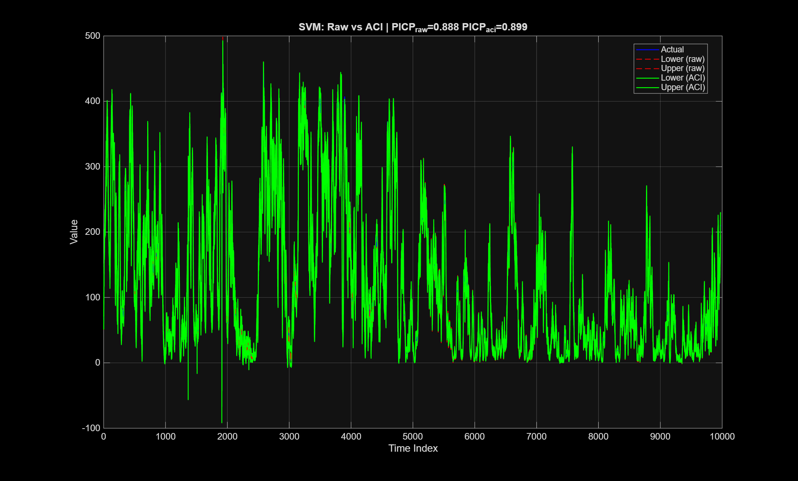
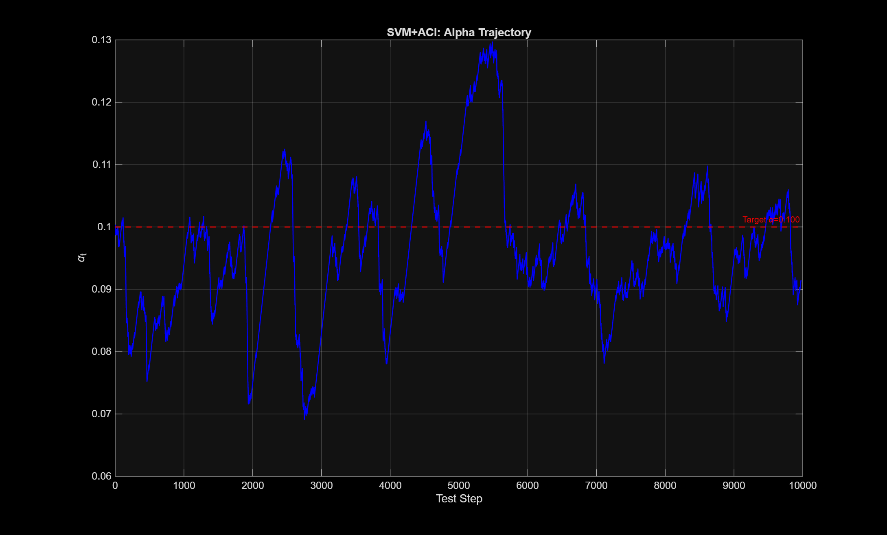
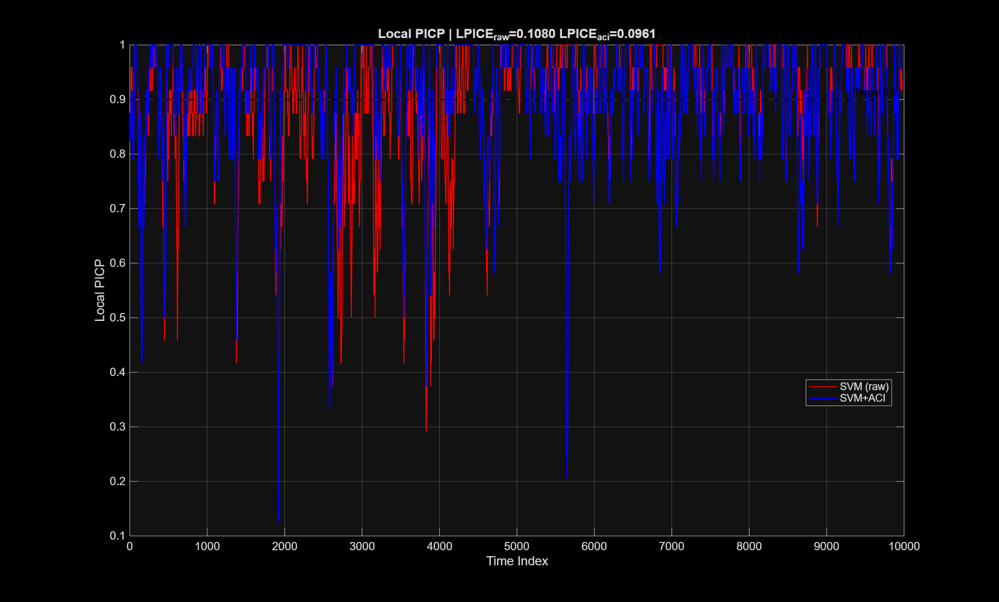
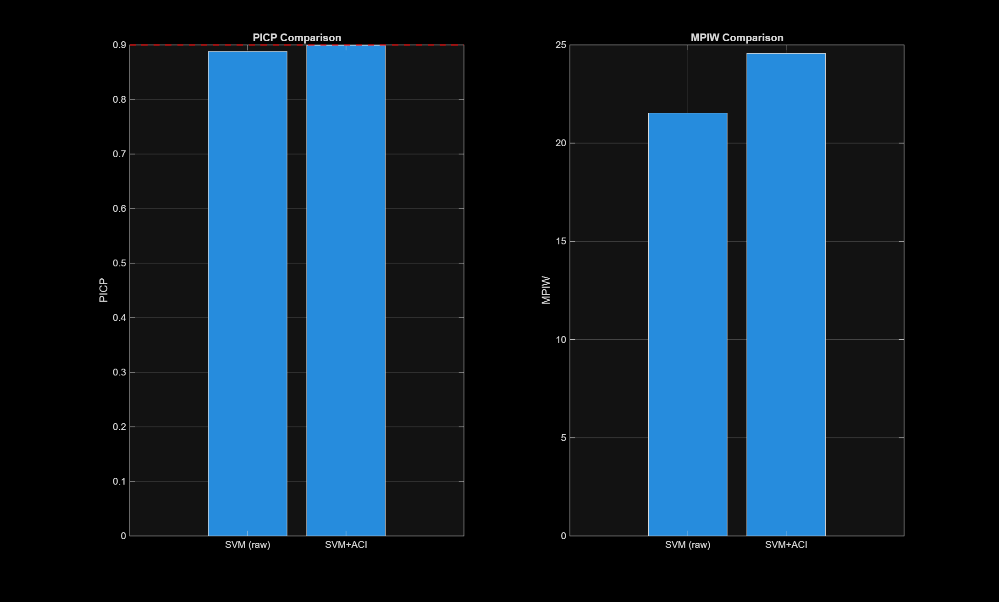
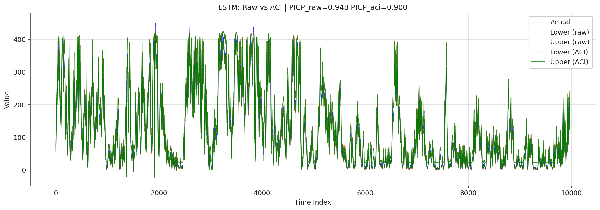
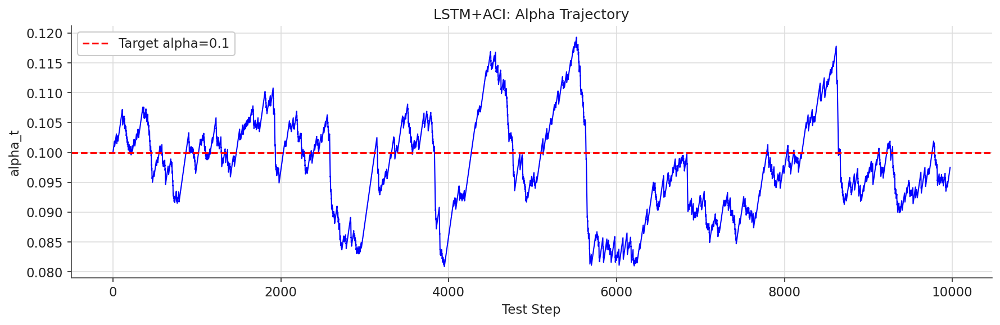
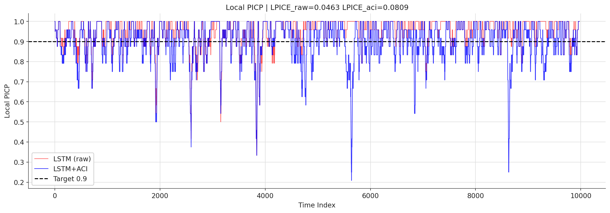
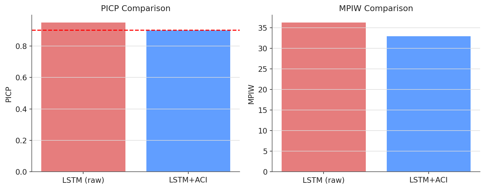

# Sec 5.4.2 — SVM Probabilistic Forecasting Under Distribution Shift (ACI: SVM + LSTM)

Applies Adaptive Conformal Inference (Gibbs & Candès 2021) to SVQR and LSTM quantile models on the Amprion load dataset. ACI online-recalibrates α using a 500-score rolling window (γ=0.001).

## Files

- `aci_svm_amprion.m` — SVM+ACI experiment (MATLAB)
- `aci_lstm_amprion.py` — LSTM+ACI experiment (Python)

## Run

SVM (MATLAB):
```matlab
aci_svm_amprion
```

LSTM (Python):
```bash
python aci_lstm_amprion.py
```

## Key results (from paper)

| Method | PICP | MPIW | Train time | Inference |
|---|---|---|---|---|
| SVM+ACI | 0.899 | 24.57 | 115.75 s | 0.34 s |
| LSTM+ACI | 0.901 | — | — | — |

Outputs written to `outputs/`.

## Figures (from paper)

### SVM + ACI

**Raw quantile intervals vs. ACI-recalibrated intervals.**



**α trajectory over the test stream** — online adaptation.



**Local PICP comparison (rolling window).**



**PICP / MPIW bar summary.**



### LSTM + ACI

**Raw vs. ACI intervals.**



**α trajectory.**



**Local PICP comparison.**



**PICP / MPIW bar summary.**


