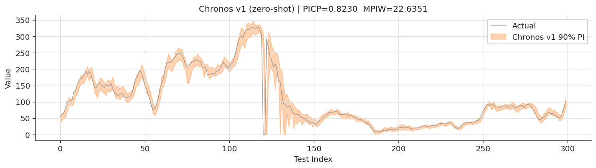
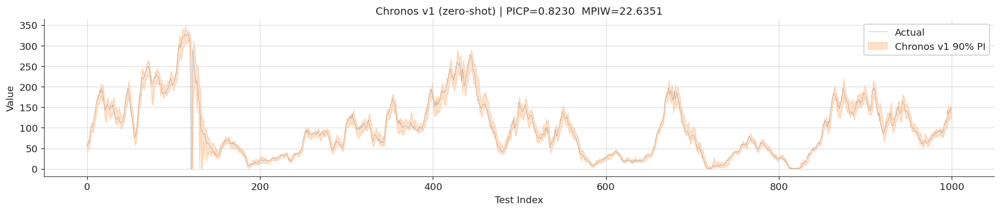

# Sec 5.4.3 — Pretrained Zero-Shot Time-Series Model (Chronos)

Evaluates Amazon Chronos v1 (zero-shot foundation model) on Amprion load forecasting. Measures σ_opt by running 10 unseeded forward passes and decomposing variance over predictions.

## Files

- `chronos_deterministic.py` — single deterministic run, reports PICP/MPIW
- `chronos_data_size_sweep.py` — sweep over training-set sizes, reports σ_opt/σ_in

## Run

```bash
python chronos_deterministic.py
python chronos_data_size_sweep.py
```

Requires `pip install chronos-forecasting` (installs `autogluon.timeseries` backend).

Outputs written to `outputs/`.

## Figures (from paper)

**Chronos zero-shot prediction intervals — first 300 test steps** (overlaid on ground truth).



**Chronos zero-shot prediction intervals — full test horizon.**



## Results

See [`outputs/results/results_chronos_v1_2026_06_30_13_11_12.csv`](outputs/results/results_chronos_v1_2026_06_30_13_11_12.csv) for per-run PICP, MPIW, σ_opt, and σ_in across data-size sweep.
