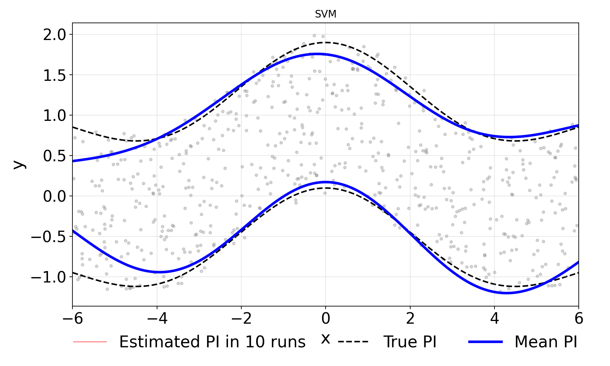
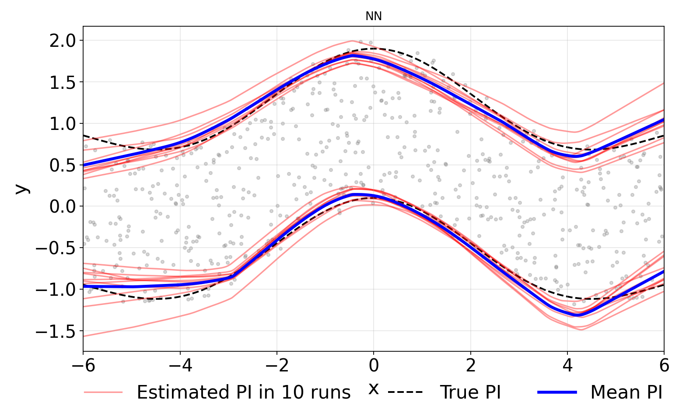
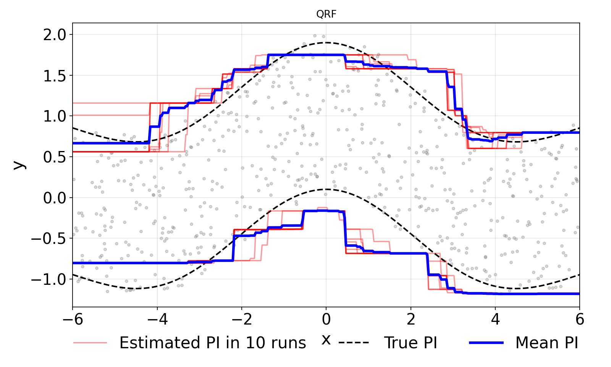
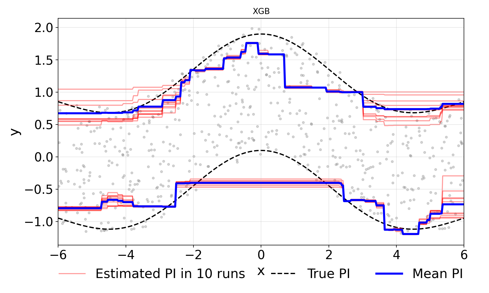
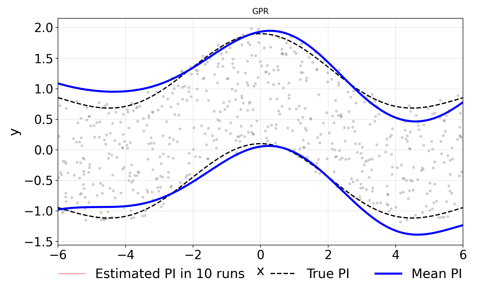
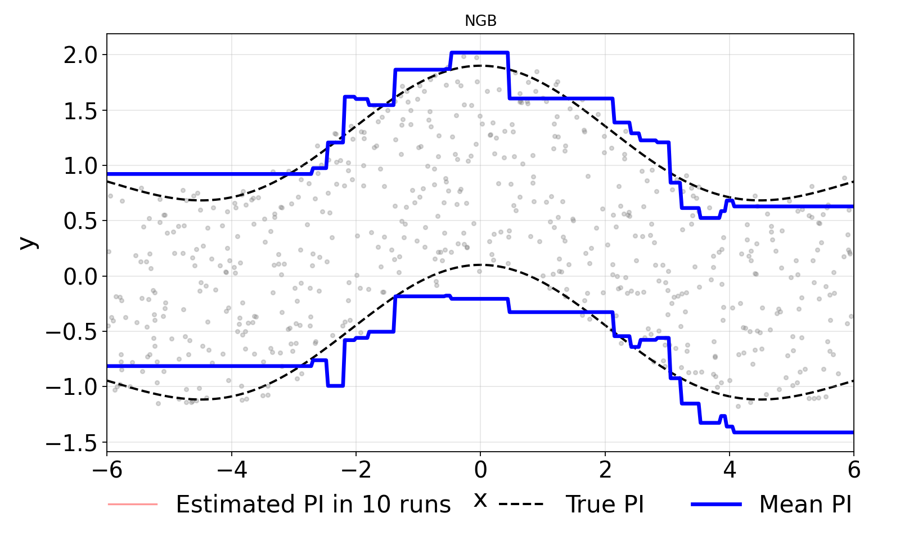

# Figure 1 — Stability Comparison: NN vs QRF vs SVM vs XGB

Reproduces Figure 1 and Table B1 of the paper. Trains four quantile regressors on a synthetic sinc dataset (n=50, M=10 members) and reports SumRMSEs, PICP, and σ²_model.

## Files

- `(NN)vs(QRF)vs(SVM.py` — main script

## Run

```bash
python "(NN)vs(QRF)vs(SVM.py"
```

## Key settings (top of script)

| Variable | Default | Meaning |
|---|---|---|
| `N_TRAIN` | 50 | Training samples |
| `M` | 10 | Ensemble members |
| `SEED` | 58 | Fixed seed |

Outputs written to `outputs/`.

## Figure 1 (from paper) — Stability of quantile intervals across ensemble members

Each panel overlays M = 10 independently-trained quantile envelopes on the sinc test function (n = 50). Tight overlap = low σ²_model.

| SVM (deterministic — zero σ_opt) | NN |
|---|---|
|  |  |

| QRF | XGB |
|---|---|
|  |  |

| GPR (deterministic) | NGB |
|---|---|
|  |  |

Numeric SumRMSE / PICP / σ²_model per model: [`stability_results_2026_06_27_16_17_00.csv`](outputs/stability_plots/stability_results_2026_06_27_16_17_00.csv).
