# Appendix A.1 — Ablation Study (Model Size: NN / QRF / XGB)

Three-stage pipeline: (1) hyperparameter tuning, (2) ablation over hidden width / n_estimators / tree depth for NN / QRF / XGB, (3) model comparison bar charts.

## Files

- `ablation_study_model_size.py` — full pipeline (stages 1-3)
- `nn_n_100.py` — standalone NN with n=100 training samples
- `ablation_figures.tex` — LaTeX figure source

## Run

Full pipeline:
```bash
python ablation_study_model_size.py
```

Skip tuning (reuse saved `best_hyperparams_*.json`):
```bash
python ablation_study_model_size.py --skip-tune
```

Ablation only:
```bash
python ablation_study_model_size.py --skip-tune --stage 2
```

**Note:** Stage 1 loads model implementations from `08. Exp 1 Figure 1/(NN)vs(QRF)vs(SVM.py` — run from the `final_github/` root or ensure that file exists.

Outputs written to `results/`.

## Figures (from paper appendix)

### NN — hidden-width ablation

| Sum RMSE vs. hidden size | σ_opt vs. hidden size |
|---|---|
| 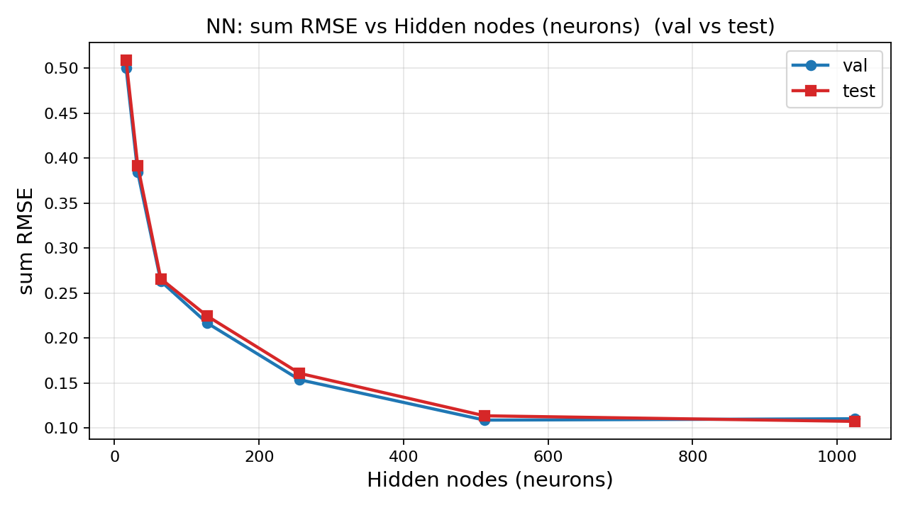 | 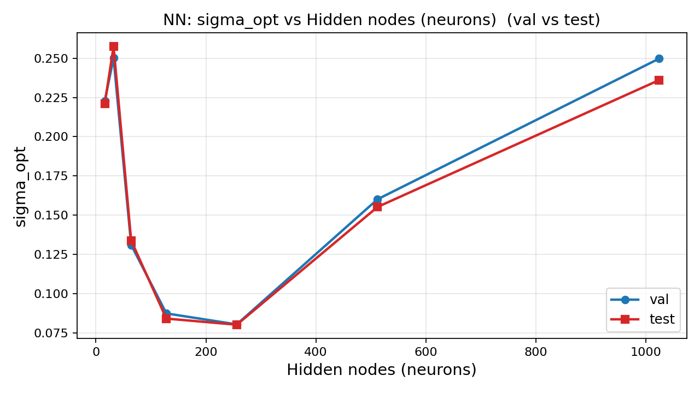 |

### QRF — n_estimators / max_features / min_samples_leaf

| Sum RMSE | σ_opt |
|---|---|
| 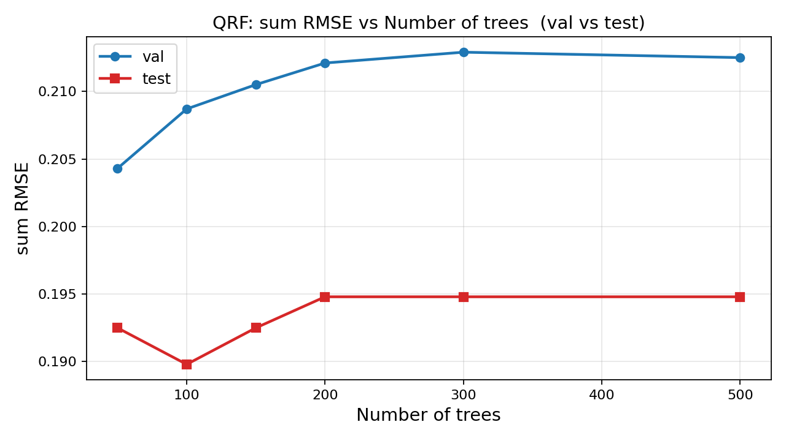 | 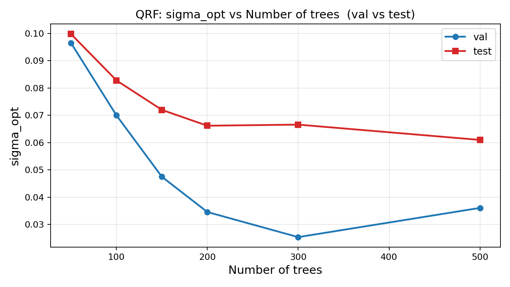 |
| 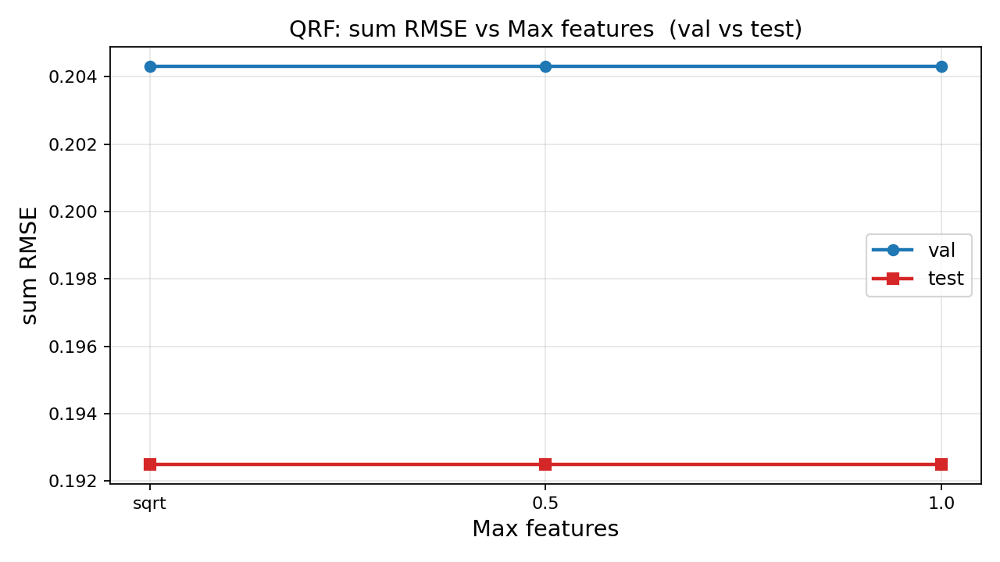 | 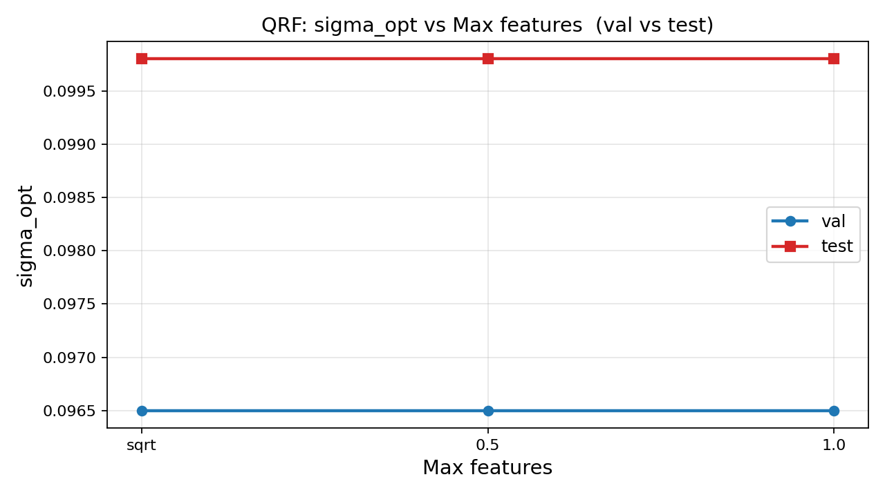 |
| 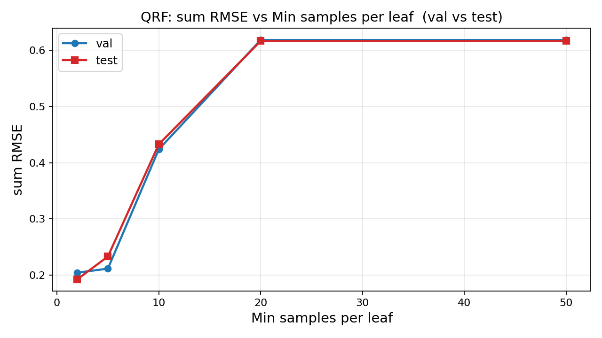 | 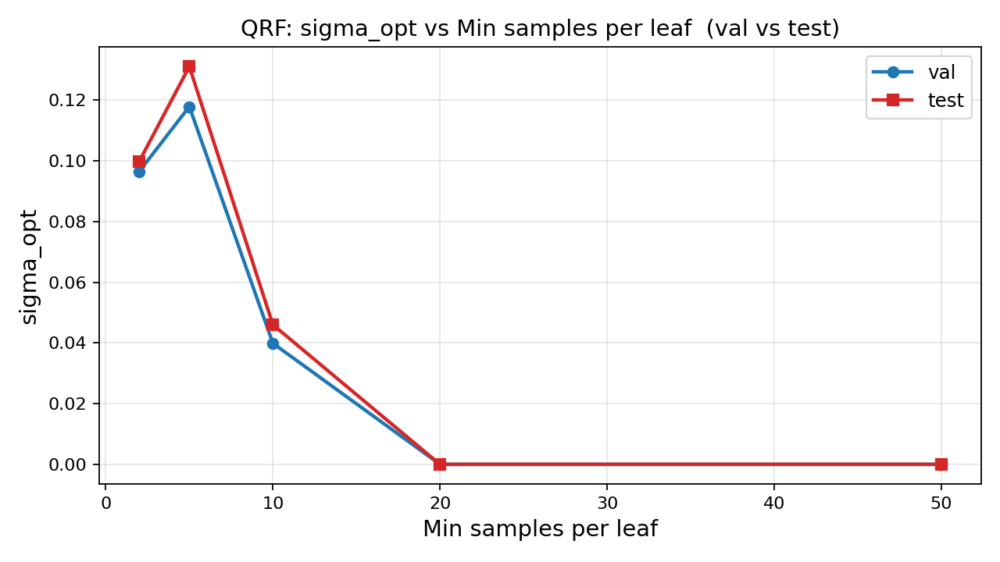 |

### XGB — n_estimators / max_depth

| Sum RMSE | σ_opt |
|---|---|
| 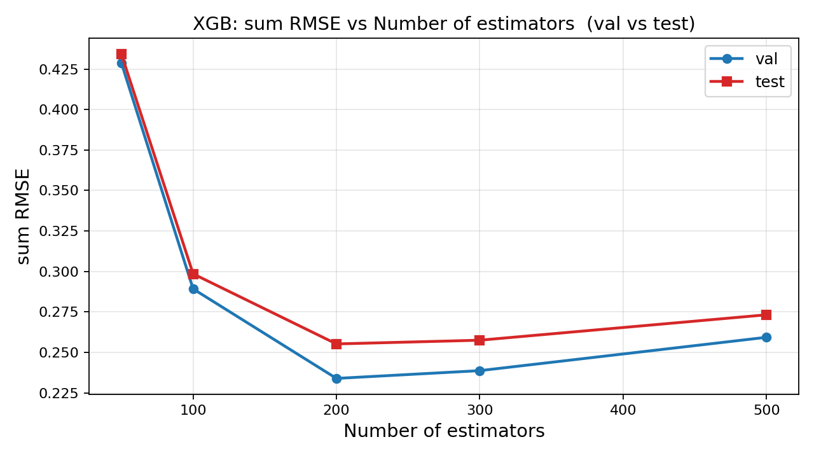 | 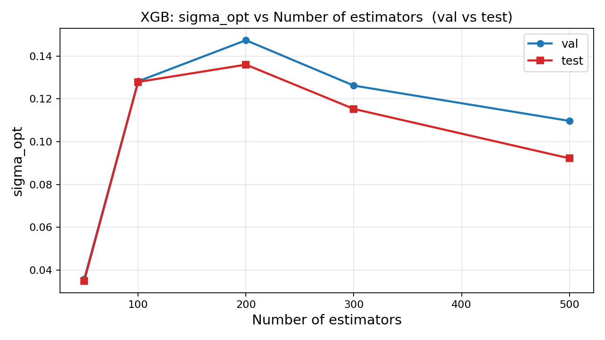 |
| 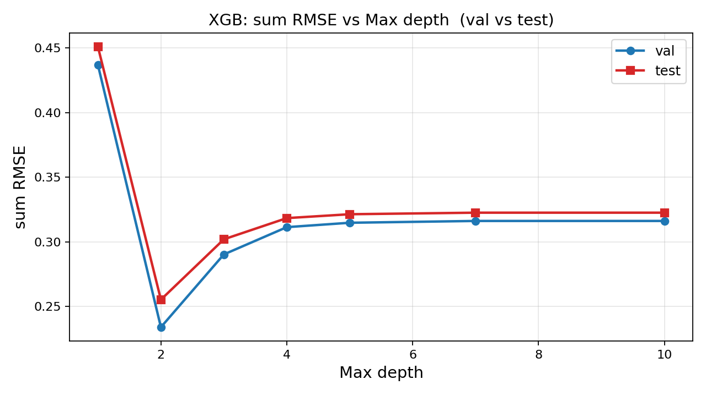 | 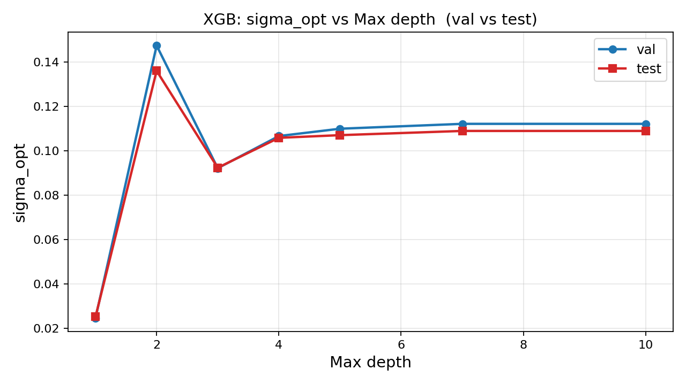 |

### Val vs. test comparison (final model)

| Sum RMSE — val vs. test | σ_opt — val vs. test |
|---|---|
| 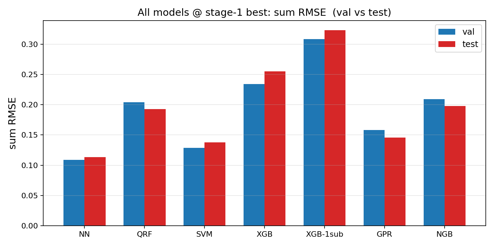 | 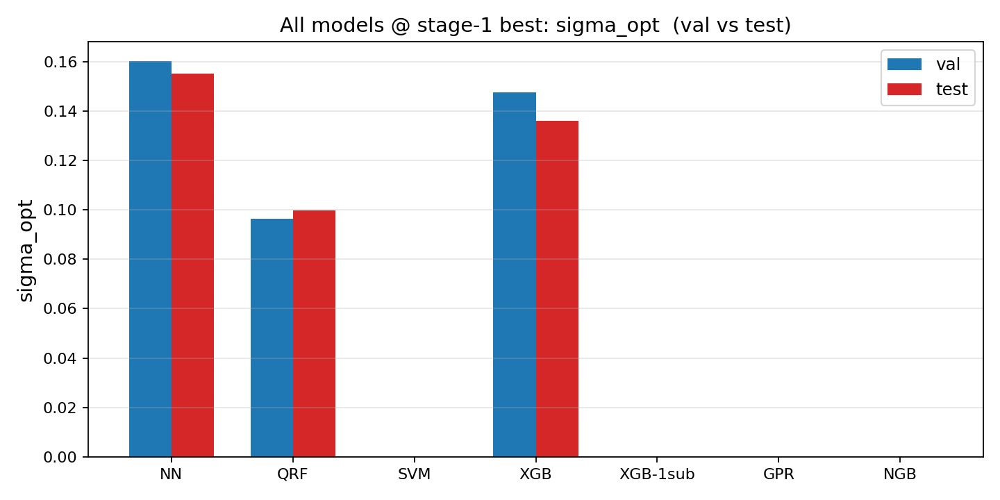 |

XGB with subsample = 1.0 variant: [xgb_1sub/](outputs/results/xgb_1sub/). NN with n = 100: [results_nn_n100/](outputs/results_nn_n100/).
