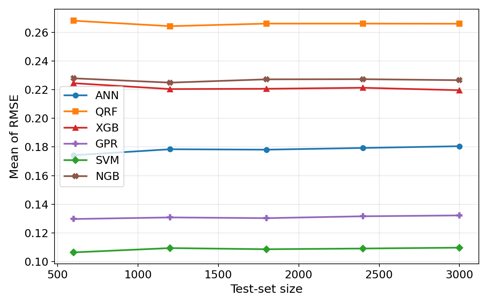
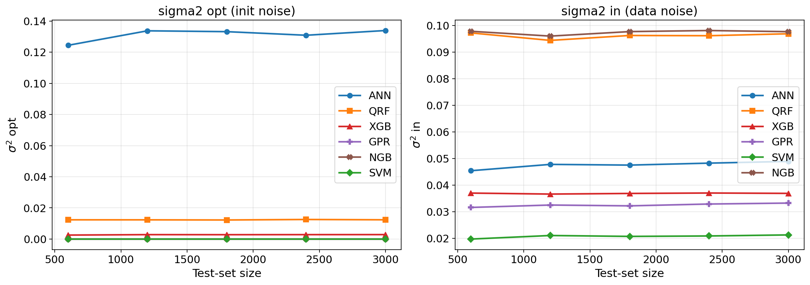
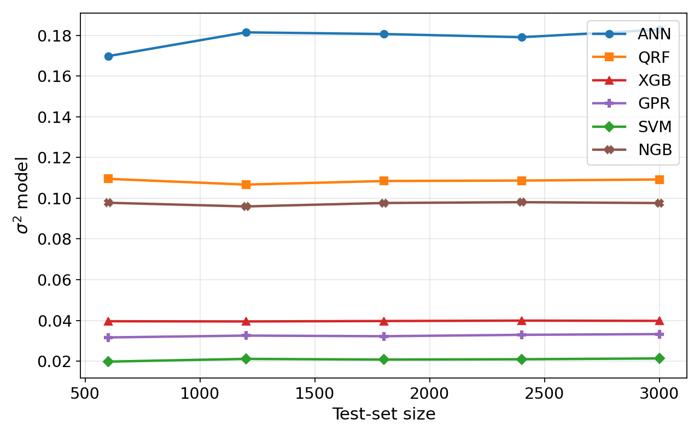

# Appendix A.2 — Test-Size Sensitivity Sweep

Checks whether reported metrics (PICP, σ_opt, σ_in) are stable as test-set size grows from 100 to 600. Uses hyperparameters from Appendix A stage-1 tuning.

## Files

- `test_size_sweep.py` — main sweep script

## Run

First run `09. Appendix A 1 Ablation study/ablation_study_model_size.py` (stage 1) to generate `best_hyperparams_*.json`, then:

```bash
python test_size_sweep.py
```

Outputs written to `outputs/`.

## Figures (from paper appendix)

**Sum RMSE vs. training size N — held-out test size varies.**



**σ_opt / σ_in decomposition vs. N.**



**σ²_model vs. N — all models overlaid.**



Metrics remain stable across test-set sizes 100 → 600, confirming the σ_opt / σ_in decomposition is not an artifact of test-set choice.
